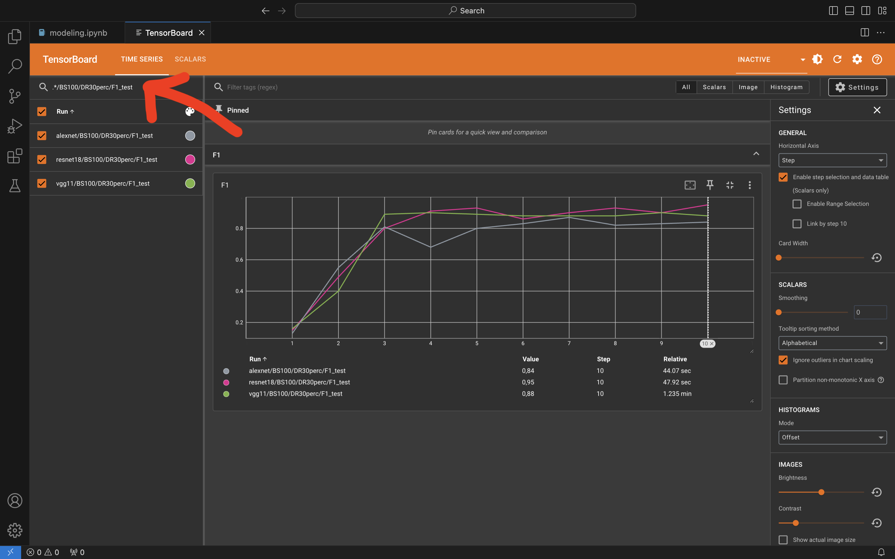
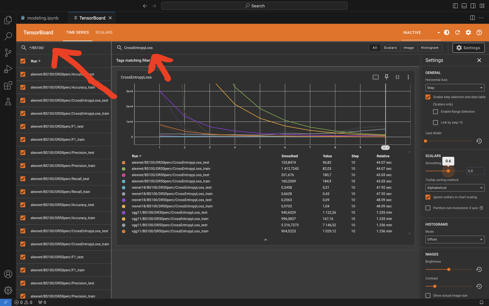

# Food image classification

## Intro

This repo was created for personal educational purposes without a goal of implementation. I used subset of [Food101](https://www.kaggle.com/datasets/dansbecker/food-101) dataset keeping only 3 types of food (targets) to classify. In the project were used different parameters and models to visualize enough experiments in TensorBoard.

## Technologies Used

- PyTorch
- TensorBoard
- Scikit-learn

## Installation and Setup
```bash
git clone https://yourproject.git
cd yourproject
pip install -r requirements.txt
```
**Final step**: open and run "modeling.ipynb"

(P.s. Training time - 14 min in Kaggle on P100 GPU)

## Result 
Tracked set of metrics with a possibility to filter them using regular expressions.
(P.s. Regular expressions highlighted with red)

#### Example №1


#### Example №2


## Possible problems:
1. **Error while downloading model on MAC**: URLError: <urlopen error [SSL: CERTIFICATE_VERIFY_FAILED] certificate verify failed: unable to get local issuer certificate (_ssl.c:1000)>. <br /> **Solution**: https://stackoverflow.com/questions/68275857/urllib-error-urlerror-urlopen-error-ssl-certificate-verify-failed-certifica